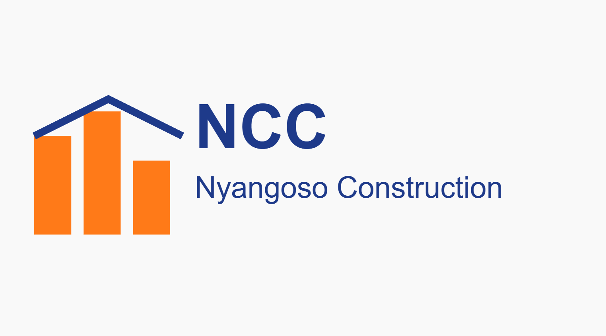
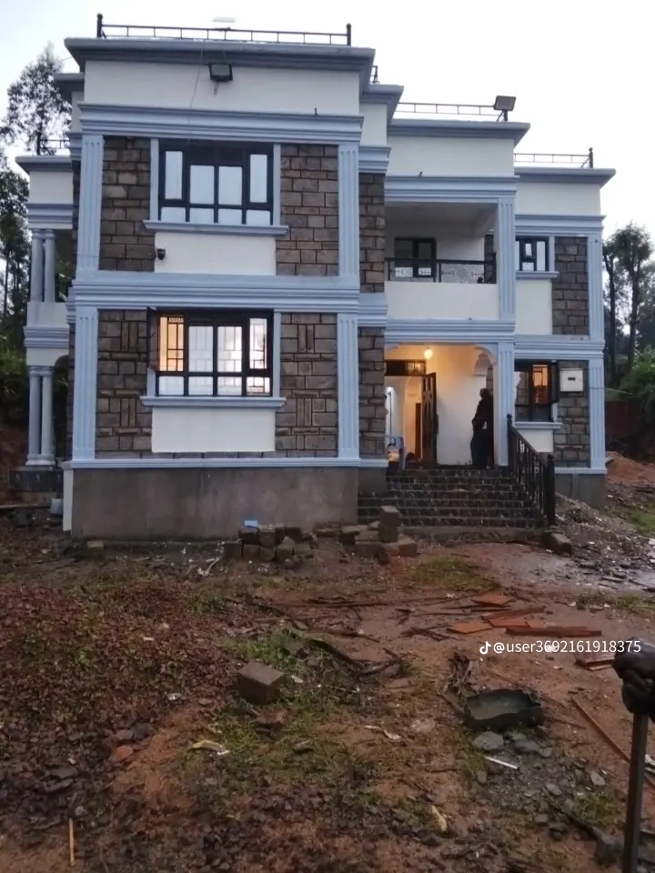

# Nyangoso Construction Company
<html lang="en">
<head>
<meta charset="UTF-8">
<meta name="viewport" content="width=device-width, initial-scale=1.0">

<!-- SEO Meta -->
<title>Nyangoso Construction Company - Nyamira, Kenya</title>
<meta name="description" content="Professional construction services in Nyamira, Kenya. Residential, commercial, and renovation projects. Contact 0799833744.">
<meta name="keywords" content="Construction, Nyamira, Kenya, Residential, Commercial, Renovation, Nyangoso Construction">
<meta name="author" content="Nyangoso Construction Company">

<!-- Favicon -->
<link rel="icon" href="logo.png" type="image/png">

</head>
<body>

<header>
  
  

    <h1>Nyangoso Construction Company</h1>
    
Building Excellence

  

</header>

<nav>
  <a href="#about">About</a>
  <a href="#services">Services</a>
  <a href="#projects">Projects</a>
  <a href="#contact">Contact</a>
  <a href="#quote">Request Quote</a>
</nav>

  <h1>We Build Your Vision</h1>
  
Trusted Construction Services in Nyamira

<section id="about">
  <h2>About Us</h2>
  

    
Nyangoso Construction Company delivers strong, modern, and reliable buildings across Nyamira and beyond.

  

</section>

<section id="services" class="services">
  <h2>Our Services</h2>
  <ul>
    <li>🏠 Residential Construction</li>
    <li>🏢 Commercial Buildings</li>
    <li>🔧 Renovations</li>
    <li>🧱 Finishing Works</li>
    <li>📐 Project Supervision</li>
  </ul>
</section>

<section id="projects">
  <h2>Our Projects</h2>
  

    
    
    
  

</section>

<section id="contact">
  <h2>Contact Us</h2>
  

    
📍 Nyamira, Kenya

    
📞 0799833744

    <a class="whatsapp-btn" href="https://wa.me/254799833744" target="_blank">Chat on WhatsApp</a>
    <iframe src="https://maps.google.com/maps?q=Nyamira%20Kenya&output=embed"></iframe>
  

</section>

<section id="quote" class="quote-form-section">
  <h2>Request a Quote</h2>
  

    <form action="https://formsubmit.co/YOUR_EMAIL_HERE" method="POST">
      <input type="text" name="name" placeholder="Full Name" required>
      <input type="email" name="email" placeholder="Email" required>
      <input type="tel" name="phone" placeholder="Phone Number" required>
      <textarea name="message" placeholder="Describe your project" rows="4" required></textarea>
      <button type="submit">Send Quote Request</button>
    </form>
  

</section>

<footer>
  
&copy; 2026 Nyangoso Construction Company | Nyamira, Kenya

</footer>

</body>
</html>
